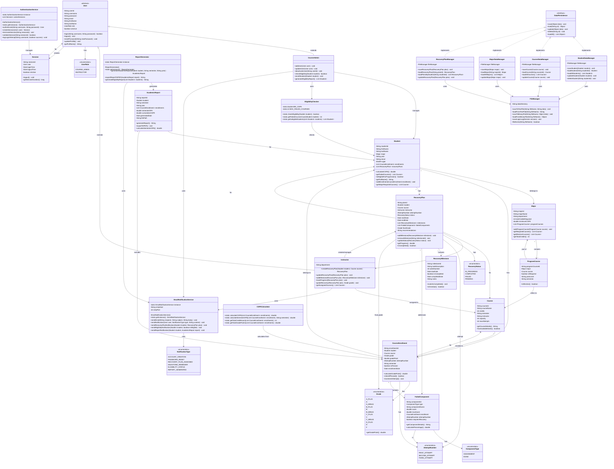

```mermaid
classDiagram
    %% Enumerations
    class UserRole {
        <<enumeration>>
        COURSE_ADMIN
        INSTRUCTOR
    }
    
    class ComponentType {
        <<enumeration>>
        ASSIGNMENT
        EXAM
    }
    
    class Grade {
        <<enumeration>>
        A_PLUS
        A
        A_MINUS
        B_PLUS
        B
        B_MINUS
        C_PLUS
        C
        C_MINUS
        D_PLUS
        D
        F
        +getGradePoint() double
    }
    
    class RecoveryStatus {
        <<enumeration>>
        IN_PROGRESS
        COMPLETED
        FAILED
        PENDING
    }
    
    class AttemptNumber {
        <<enumeration>>
        FIRST_ATTEMPT
        SECOND_ATTEMPT
        THIRD_ATTEMPT
    }
    
    class NotificationType {
        <<enumeration>>
        ACCOUNT_CREATION
        PASSWORD_RESET
        RECOVERY_PLAN_ASSIGNED
        MILESTONE_REMINDER
        ELIGIBILITY_STATUS
        REPORT_GENERATED
    }
    
    %% Abstract User Class
    class User {
        <<abstract>>
        -String userId
        -String username
        -String password
        -String email
        -String firstName
        -String lastName
        -UserRole role
        -boolean isActive
        +login(String username, String password) boolean
        +logout() void
        +resetPassword(String newPassword) void
        +updateProfile() void
        +getFullName() String*
    }
    
    %% User Subclasses
    class CourseAdmin {
        +addUser(User user) void
        +updateUser(User user) void
        +deactivateUser(String userId) void
        +checkEligibility(Student student) boolean
        +enrollStudent(Student student) void
        +generateEligibilityReport() List~Student~
    }
    
    class Instructor {
        -String department
        +createRecoveryPlan(Student student, Course course) RecoveryPlan
        +updateRecoveryPlan(RecoveryPlan plan) void
        +addMilestone(RecoveryPlan plan, RecoveryMilestone milestone) void
        +trackProgress(RecoveryPlan plan) void
        +gradeRecovery(RecoveryPlan plan, Grade grade) void
        +getAssignedCourses() List~Course~
    }
    
    %% Major/Program Class
    class Major {
        -String majorId
        -String majorName
        -String department
        -int totalCreditsRequired
        -double minimumCGPA
        -List~ProgramCourse~ programCourses
        +addProgramCourse(ProgramCourse course) void
        +getRequiredCourses() List~Course~
        +getElectiveCourses() List~Course~
        +getTotalCredits() int
    }
    
    %% Program Course (links Major to Course)
    class ProgramCourse {
        -String programCourseId
        -Major major
        -Course course
        -boolean isRequired
        -String yearLevel
        -String semester
        +isElective() boolean
    }
    
    %% Student Class
    class Student {
        -String studentId
        -String firstName
        -String lastName
        -Major major
        -String year
        -String email
        -double cgpa
        -List~CourseEnrollment~ enrollments
        -List~RecoveryPlan~ recoveryPlans
        +calculateCGPA() double
        +getFailedCourses() List~Course~
        +isEligibleForProgression() boolean
        +getFullName() String
        +addEnrollment(CourseEnrollment enrollment) void
        +getMajorRequiredCourses() List~Course~
    }
    
    %% Course Class
    class Course {
        -String courseId
        -String courseName
        -int credits
        -String semester
        -String instructor
        -int capacity
        -int maxAttempts
        +getCourseDetails() String
        +hasAvailableSeats() boolean
    }
    
    %% Course Enrollment
    class CourseEnrollment {
        -String enrollmentId
        -Student student
        -Course course
        -Grade grade
        -double gradePoint
        -AttemptNumber attemptNumber
        -String semester
        -boolean isPassed
        -Date enrollmentDate
        +calculateGradePoint() double
        +checkIfPassed() boolean
        +incrementAttempt() void
    }
    
    %% Failed Component
    class FailedComponent {
        -String componentId
        -ComponentType type
        -String componentName
        -double score
        -double maxScore
        -CourseEnrollment enrollment
        -AttemptNumber attemptNumber
        -boolean requiresRecovery
        +getComponentDetails() String
        +calculatePercentage() double
    }
    
    %% Recovery Plan
    class RecoveryPlan {
        -String planId
        -Student student
        -Course course
        -Instructor instructor
        -AttemptNumber attemptNumber
        -RecoveryStatus status
        -Date startDate
        -Date endDate
        -List~RecoveryMilestone~ milestones
        -List~FailedComponent~ failedComponents
        -Grade finalGrade
        -String recommendations
        +addMilestone(RecoveryMilestone milestone) void
        +removeMilestone(String milestoneId) void
        +updateStatus(RecoveryStatus status) void
        +getProgress() double
        +isCompleted() boolean
    }
    
    %% Recovery Milestone
    class RecoveryMilestone {
        -String milestoneId
        -String taskDescription
        -int weekNumber
        -Date dueDate
        -boolean isCompleted
        -Date completedDate
        -String notes
        +markAsCompleted() void
        +isOverdue() boolean
    }
    
    %% Academic Report
    class AcademicReport {
        -String reportId
        -Student student
        -String semester
        -String year
        -List~CourseEnrollment~ enrollments
        -double semesterGPA
        -double cumulativeCGPA
        -Date generatedDate
        -String filePath
        +generateReport() String
        +exportToPDF() void
        +calculateSemesterGPA() double
    }
    
    %% Authentication Service
    class AuthenticationService {
        -static AuthenticationService instance
        -List~Session~ activeSessions
        -AuthenticationService()
        +static getInstance() AuthenticationService
        +authenticate(String username, String password) User
        +createSession(User user) Session
        +terminateSession(String sessionId) void
        +validateSession(String sessionId) boolean
        +logLoginAttempt(String username, boolean success) void
    }
    
    %% Session Class
    class Session {
        -String sessionId
        -User user
        -Date loginTime
        -Date logoutTime
        -boolean isActive
        +logout() void
        +getSessionDuration() long
    }
    
    %% Email Notification Service
    class EmailNotificationService {
        -static EmailNotificationService instance
        -String smtpHost
        -int smtpPort
        -EmailNotificationService()
        +static getInstance() EmailNotificationService
        +sendEmail(String recipient, String subject, String body) void
        +sendNotification(User user, NotificationType type, String content) void
        +sendRecoveryPlanNotification(Student student, RecoveryPlan plan) void
        +sendEligibilityNotification(Student student, boolean isEligible) void
        +sendReportNotification(Student student, AcademicReport report) void
    }
    
    %% Report Generator
    class ReportGenerator {
        -static ReportGenerator instance
        -ReportGenerator()
        +static getInstance() ReportGenerator
        +generateAcademicReport(Student student, String semester, String year) AcademicReport
        +exportReportToPDF(AcademicReport report) String
        +generateEligibilityReport(List~Student~ students) String
    }
    
    %% Eligibility Checker
    class EligibilityChecker {
        -static double MIN_CGPA
        -static int MAX_FAILED_COURSES
        +static checkEligibility(Student student) boolean
        +static getFailedCoursesCount(Student student) int
        +static getIneligibleStudents(List~Student~ students) List~Student~
    }
    
    %% CGPA Calculator
    class CGPACalculator {
        +static calculateCGPA(List~CourseEnrollment~ enrollments) double
        +static calculateSemesterGPA(List~CourseEnrollment~ enrollments, String semester) double
        +static getTotalCreditHours(List~CourseEnrollment~ enrollments) int
        +static getTotalGradePoints(List~CourseEnrollment~ enrollments) double
    }
    
    %% Data Persistence Interface
    class DataPersistence {
        <<interface>>
        +save(Object data) void
        +load(String id) Object
        +update(Object data) void
        +delete(String id) void
        +loadAll() List~Object~
    }
    
    %% File Manager
    class FileManager {
        -String dataDirectory
        +saveToTextFile(String fileName, String data) void
        +loadFromTextFile(String fileName) String
        +saveToBinaryFile(String fileName, Object data) void
        +loadFromBinaryFile(String fileName) Object
        +saveLoginLog(Session session) void
        +fileExists(String fileName) boolean
    }
    
    %% Student Data Manager
    class StudentDataManager {
        -FileManager fileManager
        +saveStudent(Student student) void
        +loadStudent(String studentId) Student
        +loadAllStudents() List~Student~
        +updateStudent(Student student) void
        +deleteStudent(String studentId) void
    }
    
    %% Course Data Manager
    class CourseDataManager {
        -FileManager fileManager
        +saveCourse(Course course) void
        +loadCourse(String courseId) Course
        +loadAllCourses() List~Course~
        +updateCourse(Course course) void
    }
    
    %% Major Data Manager
    class MajorDataManager {
        -FileManager fileManager
        +saveMajor(Major major) void
        +loadMajor(String majorId) Major
        +loadAllMajors() List~Major~
        +updateMajor(Major major) void
    }
    
    %% Recovery Plan Manager
    class RecoveryPlanManager {
        -FileManager fileManager
        +saveRecoveryPlan(RecoveryPlan plan) void
        +loadRecoveryPlan(String planId) RecoveryPlan
        +loadPlansByStudent(String studentId) List~RecoveryPlan~
        +updateRecoveryPlan(RecoveryPlan plan) void
    }
    
    %% Relationships
    User <|-- CourseAdmin : extends
    User <|-- Instructor : extends
    User --> UserRole : has
    User --> Session : creates
    
    CourseAdmin --> Student : manages
    CourseAdmin --> EligibilityChecker : uses
    
    Instructor --> RecoveryPlan : creates/manages
    Instructor --> Course : assigned to
    
    Student --> Major : belongs to
    Student "1" --> "*" CourseEnrollment : has
    Student "1" --> "*" RecoveryPlan : has
    
    Major "1" --> "*" ProgramCourse : contains
    ProgramCourse --> Course : refers to
    ProgramCourse --> Major : part of
    
    Course "1" --> "*" CourseEnrollment : enrolled in
    
    CourseEnrollment --> Grade : has
    CourseEnrollment --> AttemptNumber : has
    CourseEnrollment --> Student : belongs to
    CourseEnrollment --> Course : for
    CourseEnrollment "1" --> "*" FailedComponent : contains
    
    FailedComponent --> ComponentType : has
    FailedComponent --> AttemptNumber : in
    
    RecoveryPlan --> Student : for
    RecoveryPlan --> Course : for
    RecoveryPlan --> Instructor : managed by
    RecoveryPlan --> RecoveryStatus : has
    RecoveryPlan --> AttemptNumber : attempt
    RecoveryPlan "1" --> "*" RecoveryMilestone : contains
    RecoveryPlan "1" --> "*" FailedComponent : addresses
    RecoveryPlan --> Grade : final grade
    
    AcademicReport --> Student : for
    AcademicReport "1" --> "*" CourseEnrollment : includes
    
    AuthenticationService --> Session : manages
    Session --> User : for
    
    EmailNotificationService --> NotificationType : uses
    
    ReportGenerator --> AcademicReport : generates
    
    EligibilityChecker --> Student : checks
    CGPACalculator --> CourseEnrollment : calculates from
    
    DataPersistence <|.. StudentDataManager : implements
    DataPersistence <|.. CourseDataManager : implements
    DataPersistence <|.. MajorDataManager : implements
    DataPersistence <|.. RecoveryPlanManager : implements
    
    StudentDataManager --> FileManager : uses
    CourseDataManager --> FileManager : uses
    MajorDataManager --> FileManager : uses
    RecoveryPlanManager --> FileManager : uses
    
    CourseAdmin --> EmailNotificationService : uses
    Instructor --> EmailNotificationService : uses
    ReportGenerator --> EmailNotificationService : uses
```